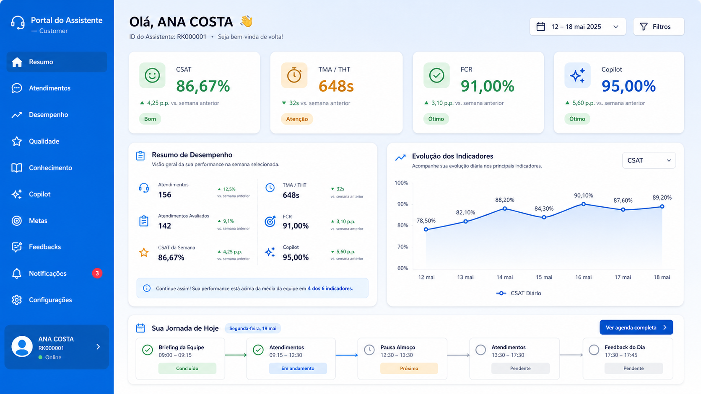
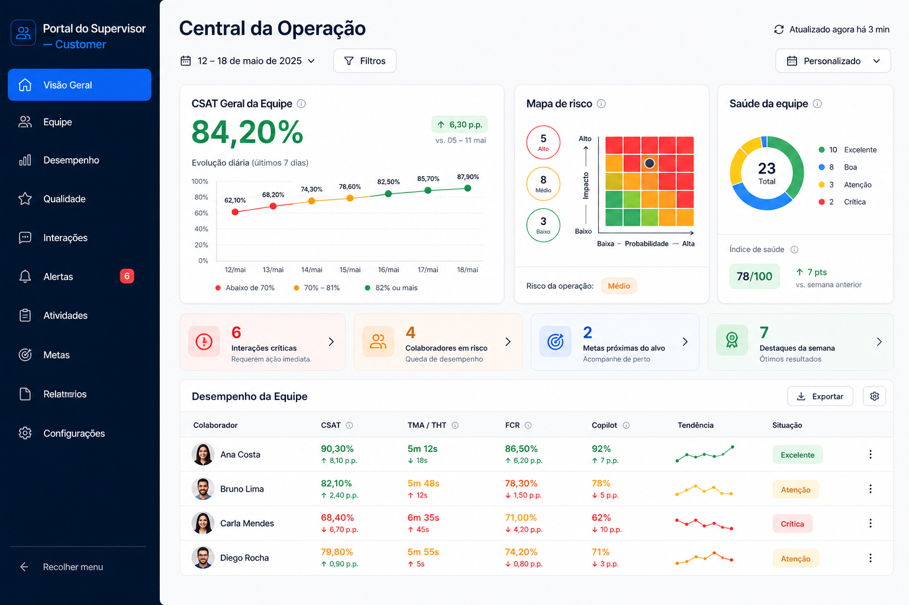
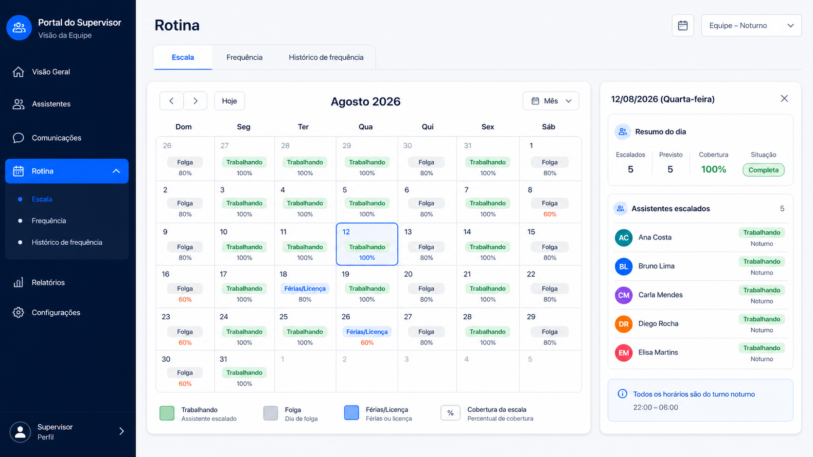

# Portal Customer — Showcase

Projeto de portfólio para apresentar a experiência visual e as principais funcionalidades do **Portal Customer**, uma solução interna criada para apoiar assistentes e supervisores no acompanhamento da operação.

> Este repositório é exclusivamente demonstrativo. O código-fonte, identificadores de planilhas, integrações e dados operacionais permanecem em repositório privado.

## Demonstração visual

Todas as pessoas, identificadores, datas e resultados abaixo são fictícios.

### Portal do Assistente — visão de desempenho

### Portal do Supervisor — central da operação

### Portal do Supervisor — rotina e escala

## Visão geral

O projeto é dividido em dois ambientes integrados:

### Portal do Assistente

- Indicadores de CSAT, TMA/THT, FCR e Copilot
- Evolução diária e histórico mensal
- Escala de trabalho com folgas, férias, licenças e pausas
- Análises e feedbacks
- Comunicações e biblioteca de conteúdos
- Temas claro e escuro

### Portal do Supervisor

- Dashboard operacional da equipe
- CSAT geral com tendência diária
- Mapa de risco e saúde da equipe
- Visão 360° por assistente
- Evolução individual dos indicadores
- Escala mensal da equipe
- Controle e histórico de frequência
- Registro de presença, atrasos, ausências e atestados

## Experiência e design

- Interface consistente em todas as áreas
- Navegação lateral fixa
- Cards de indicadores com cores orientadas por metas
- Visualizações pensadas para notebook e desktop
- Calendários e gráficos de leitura rápida
- Componentes organizados por contexto operacional

## Tecnologias

- Google Apps Script
- HTML5
- CSS3
- JavaScript
- Google Sheets
- Chart.js

## Privacidade

As imagens públicas utilizam somente dados demonstrativos. Nenhum e-mail corporativo, matrícula real, ID de planilha ou informação operacional sensível é publicado aqui.

## Autoria

Desenvolvido por **Thaís Moreira** como projeto de melhoria da experiência operacional e centralização de informações.
